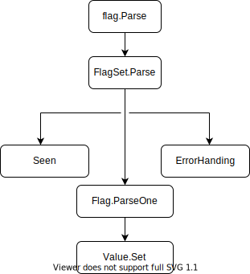

##  初始化项目

```bash
$ mkdir -p $HOME/go-programming-tour-book/tour
$ cd $HOME/go-programming-tour-book/tour
$ go mod init github.com/go-programming-tour-book/tour
```

命令含义如下：

- 确定本书项目路径，并`mkdir -p ...`新建项目目录
- 切换到工作目录下
- 初始化项目的Go modules，设置项目的模块路径

##  示例

###  1. 标准库flag的基本使用和长短选项

```go
import "flag"
func main() {
    var name string
    flag.StringVar(&name, "name", "Go语言编程之旅", "帮助信息")
    flag.StringVar(&name, "n", "Go语言编程之旅", "帮助信息")
    flag.Parse()
}
```

​	上述代码调用标准库flag的`StringVar`函数实现对命令行参数name的解析和绑定，其余形参分别代表：命令行标识位的名称，默认值和帮助信息。命令行参数支持如下三种命令行标志语法：

- -flag：仅支持布尔类型
- -flag x：仅支持非布尔类型
- flag=x：支持所有类型

运行该程序：

```bash
$ go run main.go -name=南神 -n=男神
name: 男神
```

### 2. 子命令的使用

在日常使用的命令行程序中，子命令功能是比较常规的，比如`cfy model update`，如何用`flag`标准库实现：

```go
package main

import (
	"flag"
	"log"
)

func main() {
	var name string
	flag.Parse()
	goCmd := flag.NewFlagSet("go", flag.ExitOnError)
	goCmd.StringVar(&name, "name", "Go语言编程之旅", "帮助信息")
	phpCmd := flag.NewFlagSet("php", flag.ExitOnError)
	phpCmd.StringVar(&name, "n", "php语言我不会", "帮助信息")
	args := flag.Args()
	if len(args) <= 0 {
		return
	}
	switch args[0] {
	case "go":
		_ = goCmd.Parse(args[1:])
		// break
	case "php":
		_ = phpCmd.Parse(args[1:])
		log.Print("第二个case")
	}
	log.Printf("name: %s", name)
}
```

>  go语言的switch语句后并不需要加break

###  3. 分析

标准库flag是如何实现命令行应用的呢：



1. flag.Parse()

```go
func Parse() {
	// Ignore errors; CommandLine is set for ExitOnError.
	CommandLine.Parse(os.Args[1:])
}
```

2. CommandLine.Parse()

```go
func (f *FlagSet) Parse(arguments []string) error {
	f.parsed = true
	f.args = arguments
	for {
		seen, err := f.parseOne()
		if seen {
			continue
		}
		if err == nil {
			break
		}
		switch f.errorHandling {
		case ContinueOnError:
			return err
		case ExitOnError:
			if err == ErrHelp {
				os.Exit(0)
			}
			os.Exit(2)
		case PanicOnError:
			panic(err)
		}
	}
	return nil
}
```

3. FlagSet.ParseOne()

```go
// 第一步，首先判断是否是一个合法的flag
func (f *FlagSet) parseOne() (bool, error) {
	if len(f.args) == 0 {
		return false, nil
	}
	s := f.args[0]
	if len(s) < 2 || s[0] != '-' {
		return false, nil
	}
	numMinuses := 1
	if s[1] == '-' {
		numMinuses++
		if len(s) == 2 { // "--" terminates the flags
			f.args = f.args[1:]
			return false, nil
		}
	}
	name := s[numMinuses:]
	if len(name) == 0 || name[0] == '-' || name[0] == '=' {
		return false, f.failf("bad flag syntax: %s", s)
	}
    // it's a flag. does it have an argument?
    // 2. 判断是否有参数
	f.args = f.args[1:]
	hasValue := false
	value := ""
	for i := 1; i < len(name); i++ { // equals cannot be first
		if name[i] == '=' {
			value = name[i+1:]
			hasValue = true
			name = name[0:i]
			break
		}
	}
	m := f.formal
	flag, alreadythere := m[name] // BUG
	if !alreadythere {
		if name == "help" || name == "h" { // special case for nice help message.
			f.usage()
			return false, ErrHelp
		}
		return false, f.failf("flag provided but not defined: -%s", name)
	}
	// 3. 判断是否是bool类型 如果不是则必须指定值
	if fv, ok := flag.Value.(boolFlag); ok && fv.IsBoolFlag() { // special case: doesn't need an arg
		if hasValue {
			if err := fv.Set(value); err != nil {
				return false, f.failf("invalid boolean value %q for -%s: %v", value, name, err)
			}
		} else {
			if err := fv.Set("true"); err != nil {
				return false, f.failf("invalid boolean flag %s: %v", name, err)
			}
		}
	} else {
		// It must have a value, which might be the next argument.
		if !hasValue && len(f.args) > 0 {
			// value is the next arg
			hasValue = true
			value, f.args = f.args[0], f.args[1:]
		}
		if !hasValue {
			return false, f.failf("flag needs an argument: -%s", name)
		}
		if err := flag.Value.Set(value); err != nil {
			return false, f.failf("invalid value %q for flag -%s: %v", value, name, err)
		}
	}
	if f.actual == nil {
		f.actual = make(map[string]*Flag)
	}
	f.actual[name] = flag
	return true, nil
}
```

###  4. 自定义值类型

flag的命令行参数类型是可以自定义的，需要实现Value接口：

```go
type Value interface {
    String() string
    Set(string) error
}
```

将一开始的字符串变量name修改为类别别名，并实现Value的接口：

```go
package main

import (
	"errors"
	"flag"
	"fmt"
	"log"
)

// Name 自定义类型  用来自定义flag.Var参数类型
type Name string

func (i *Name) String() string {
	return fmt.Sprint(*i)
}

// Set 实现Value接口
func (i *Name) Set(value string) error {
	if len(*i) > 0 {
		return errors.New("name flage already set")
	}
	*i = Name("eddycjy:" + value)
	return nil
}

func main() {
	var name Name
	flag.Var(&name, "name", "帮助信息")
	flag.Parse()
	log.Printf("name: %s", name)
}
```

