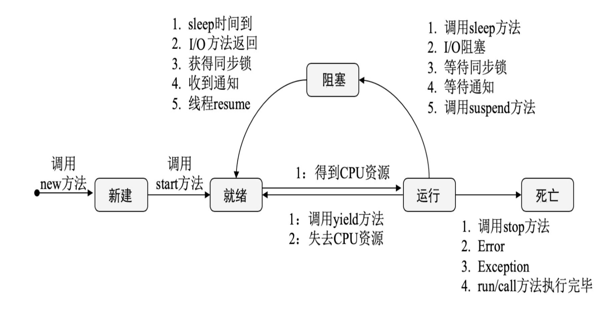

###  线程的声明周期

线程的生命周期分为新建(new)、jiuxu(Runnable)、运行(Running)、阻塞(Blocked)、和死亡(Dead)五种状态。在系统运行过程中不断有新的线程被创建，旧的线程在执行完毕后被清理，线程在排队获取共享资源或锁时将被阻塞，因此运行中的线程会在就绪、阻塞、运行状态之间来回切换:



其流程如下：

1. 调用new方法新建一个线程，此时线程处于就绪状态
2. 调用start方法启动一个线程，这时线程处于就绪状态
3. 处于就绪状态的线程等待线程获取CPU资源，在等待期获取CPU资源后会执行run方法进入运行状态
4. 正在运行的线程在调用了yield方法或失去处理器资源时，会再次进入就绪状态
5. 正在执行的线程在执行了sleep方法、I/O阻塞、等待同步锁、等待通知等操作后，会挂起并且进入阻塞状态
6. 阻塞状态由于sleep时间已到、I/O返回、收到通知、获得同步锁等情况，会再次进入就绪状态
7. 处于运行状态的线程，在调用run或者call方法正确执行完成后、或者调用stop方法停止该线程或者程序执行错误导致异常退出时，会进入死亡状态。

######  1. 新建状态：New

在Java中使用new关键字创建一个线程，新创建的线程将处于新建状态。在创建线程时主要是为线程分配内存并初始化其成员变量的值。

######  2. 就绪状态：Runnable

新建的线程对象在调用start方法之后将转为就绪状态。此时JVM完成了方法调用栈和程序计数器的创建，等待该线程的调度和执行

######  3. 运行状态：Running

就绪状态的线程在竞争到CPU的使用权并开始执行run方法时，会转为运行状态

######  4. 阻塞状态 ：Blocked

运行中的线程会主动或被动地放弃CPU的使用权并暂停运行，此时该线程将转为阻塞状态，直到再次进入可运行状态，才有机会再次竞争到CPU使用权并转为运行状态。

######  5. 死亡状态：Dead

线程在以下三种方式结束后转为死亡状态：

- 线程正常结束：run或者call方法执行完成
- 线程异常退出：运行中的线程抛出一个Error或未捕获的Exception，线程异常退出
- 手动结束：调用线程对象的stop方法手动结束运行中的线程（该方法会瞬间释放线程占用的同步对象锁，导致锁混乱和死锁，不推荐使用）

###  线程的基本方法

线程相关的基本方法有wait、notify、notifyAll、sleep、join、yield等

#####  1. 线程等待：wait方法

调用wait方法的线程会进入WAITING状态，只有等到其他线程的通知或被中断后才会返回。需要注意的是，在调用wait方法后会释放对象的锁。

#####  2. 线程睡眠：sleep方法

调用sleep方法会导致当前线程休眠，不会释放锁，在sleep时间到后会进入就绪状态。

#####  3. 线程让步：yield方法

调用yield方法会使当前线程让出CPU执行时间片，与其他线程一起竞争时间片，但是线程之间是有优先级的。

#####  4. 线程加入：join方法

join方法用于等待其他线程终止，如果在当前线程中调用一个线程的join方法，则当前线程转化为就绪状态，等待获取CPU的使用权。

```java
		System.out.println("子线程开始运行");
    ChildThreadDemo thread = new ChildThreadDemo();
    thread.start();
    thread.join();
    System.out.println("子线程join结束");
```

####  sleep和wait方法的区别

- sleep方法属于Thread类，wait方法属于Object类
- sleep方法暂停执行指定的时间，让出CPU给其他线程，但其监控状态依然保持，在指定的时间过后又会自动恢复运行状态
- 在调用sleep方法的过程中，线程不会释放对象锁
- 在调用wait方法时，线程会放弃对象锁，进入等待此对象的等待锁池，只有针对此对象调用notify方法后，该线程才能进入对象所池准备获取对象锁，并进入运行状态


