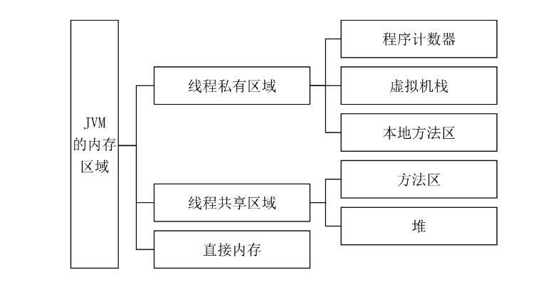
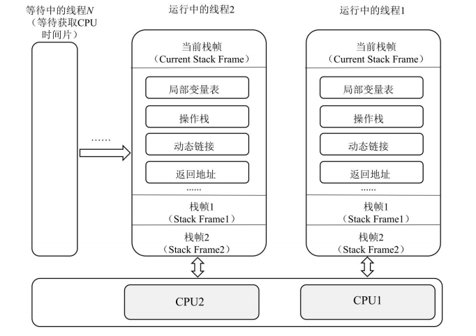
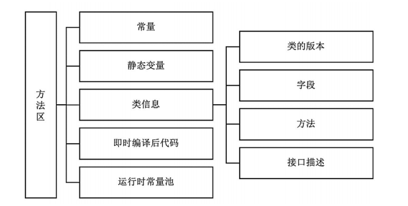

# JVM的内存区域

JVM的内存区域分为线程私有区域（程序计数器，虚拟机栈，本地方法栈）、线程共有区域（虚拟机堆，方法区）和直接内存。

线程私有区域的生命周期与线程相同，随线程的启动而创建，随线程的结束而销毁。在JVM中，每个线程都与操作系统的本地线程直接映射。

共享线程区域随虚拟机的启动而创建，随虚拟机的关闭而销毁。

### 1. 程序技计数器
线程私有，无内存溢出问题。程序计数器是一块很小的内存空间，用于存储当前运行的线程所执行的字节码行号指示器。每个运行的线程中有一个独立的程序计数器，在方法正在执行时，该方法的程序计数器记录的是实时虚拟机字节码指令的地址；如果该方法是Native方法，则程序计数器的值为空。

### 2. 虚拟机栈
虚拟机栈是描述Java方法的执行过程的内存模型，它在当前栈帧中存储了局部变量表、操作数栈、动态链接、方法出口等信息。

栈帧用来记录方法的执行过程，在方法执行时虚拟机会为其创建一个对应的栈帧，方法的执行和返回对应栈的入栈和出栈操作。无论是方法正常完成还是异常结束，都是为方法运行结束，下图展示了线程运行以及栈帧的变化过程。线程1在CPU1上运行，线程2在CUP2上运行，在CPU资源不足的情况下其他线程会等待。每个方法的执行和返回都对应栈的入栈和出栈。同一时间只有一个栈帧处于活跃状态。

### 3. 本地方法栈

本地方法栈和虚拟机栈的作用相似，只不过内部是存储的是Java的Native方法。

### 4. 堆 也叫运行时数据区，线程共享

在JVM运行过程中产生的对象都存放在堆上，堆是线程共享的，也是垃圾收集器主要进行收集的区域。可以分为新生代和老年代。Java8之前还有永久代。

### 5. 方法区

方法区用来存储常量，类模板信息，静态变量，即时编译器编译后的机器码，运行时常量池等数据。

