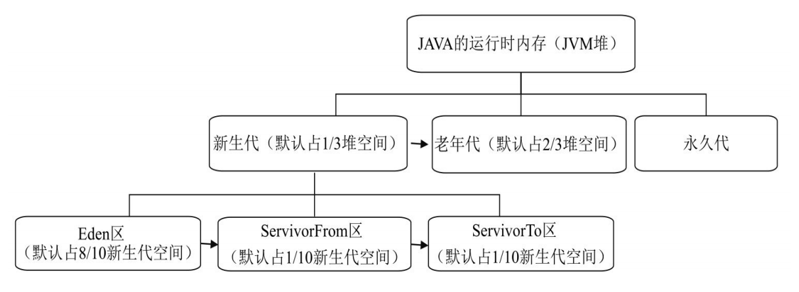

# JVM的堆

JVM的堆也叫JVM的运行时内存，从GC的角度可以将JVM堆分为新生代，老年代和永久代。其中新生代默认占堆1/3的内存空间，老年代默认占用堆2/3的内存空间，永久代占用非常少的堆空间。新生代分为Eden区、ServivorFrom区和、ServivorTo区，Eden区默认占据新生代8/10的内存空间，ServivorFrom和ServivorTo各占1/10的内存空间。

### 新生代：Eden区、ServivorTo区和ServivorFrom区

JVM创建的对象（除了大对象）都会先分配在新生代，在新生代经过若干次垃圾回收仍然存活的对象会被转移到老年代。新生代的垃圾回收叫做MinorGC。

#### Eden区

JVM创建的对象（除了大对象）都会先分配到Eden区，Eden区默认占据8/10新生代空间，Eden区的内存不足则会触发一次MinorGC。

#### ServivorFrom区

ServivorFrom区扫描上次MinorGC存活的对象，如果仍然存活，则将其移入ServivorTo区

#### ServivorTo区

ServivorTo区和ServivorFrom在经过一次MinorGC会互换，因为新生代采用的是复制算法，保留上一次MinorGC的幸存者。

**新生代的垃圾回收采用复制算法：**

1. 扫描Eden区和ServivorFrom区的存活对象，将其移入ServivorTo区。

2. 清空Eden区和ServivorFrom区
3. ServivorFrom区和ServivorTo区互换