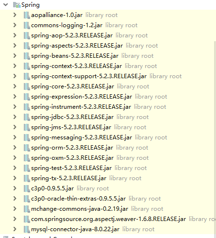

使用spring的声明式来进行事务管理。

spring声明式事务底层采用AOP技术，其优点在于不需要通过编程的方式管理事务，只需要在配置文件中进行相关的规则说明，就可以将事务应用到业务逻辑中。

spring实现声明式事务的方式主要有两种：

- 基于xml的声明式事务
- 基于annotation的声明式事务

以下是基于xml的声明式事务demo：

1. 首先我们需要导入相关的jar包，除了spring的包之外，还需要aspectJ包，JDBC mysql的驱动包，C3P0的包等：

   

2. 建立C3P0的配置文件c3p0-db.properties

   ```properties
   jdbc.driverClass = com.mysql.cj.jdbc.Driver
   jdbc.jdbcUrl = jdbc:mysql://localhost:3306/spring?serverTimezone=GMT
   jdbc.user = root
   jdbc.password = nan1065539573
   ```

3. 建立spring数据库，并且建立Account表，在其中插入两条数据

   ```sql
   CREATE DATABASE spring;
   USE spring;
   CREATE TABLE account (
       id INT (11) PRIMARY KEY AUTO_INCREMENT,
       username VARCHAR(20) NOT NULL,
       money INT DEFAULT NULL
   );
   INSERT INTO account VALUES (1,'zhangsan',1000);
   INSERT INTO account VALUES (2,'lisi',1000);
   ```

4. 建立`com.nansl.dao`包，新建`AccountDao`接口

   ```java
   package com.nansl.dao;
   
   public interface AccountDao {
       public void out(String outUser, int money);
   
       public void in(String inUser, int money);
   }
   
   ```

5. 建立`com.nansl.dao.impl`包，建立`AccountDao`的实现类

   ```java
   package com.nansl.dao.impl;
   
   import com.nansl.dao.AccountDao;
   import org.springframework.jdbc.core.JdbcTemplate;
   
   public class AccountDaoImpl implements AccountDao {
       private JdbcTemplate jdbcTemplate;
   
       public void setJdbcTemplate(JdbcTemplate jdbcTemplate) {
           this.jdbcTemplate = jdbcTemplate;
       }
   
       @Override
       public void out(String outUser, int money) {
           this.jdbcTemplate.update("update account set money =money-? "
                   + "where username =?", money, outUser);
       }
   
       @Override
       public void in(String inUser, int money) {
           this.jdbcTemplate.update("update account set money =money+? "
                   + "where username =?", money, inUser);
       }
   }
   
   ```

   这里使用`JdbcTemplate`的update方法，分别对应转账和收款

6. 建立`com.nansl.service`包，并且建立`AccountService`接口

   ```java
   package com.nansl.service;
   
   public interface AccoountService {
       // 转账
       public void transfer(String outUser, String inUser, int money);
   }
   
   ```

7. 建立`com.nansl.service.impl`包，并且建立`AccountService`接口的实现类

   ```java
   package com.nansl.service.impl;
   
   import com.nansl.dao.AccountDao;
   import com.nansl.service.AccoountService;
   
   public class AccountServiceImpl implements AccoountService {
       private AccountDao accountDao;
   
       public void setAccountDao(AccountDao dao) {
           this.accountDao = dao;
       }
   
       @Override
       public void transfer(String outUser, String inUser, int money) {
           accountDao.out(outUser, money);
           accountDao.in(inUser, money);
       }
   }
   
   ```

   此处调用dao层的接口，来模拟`outUser`转账给`inUser`

8. 编写spring的配置文件applicationContext.xml

   ```xml
   <?xml version="1.0" encoding="utf-8" ?>
   <beans xmlns="http://www.springframework.org/schema/beans"
          xmlns:xsi="http://www.w3.org/2001/XMLSchema-instance"
          xmlns:context="http://www.springframework.org/schema/context"
          xmlns:tx="http://www.springframework.org/schema/tx"
          xmlns:aop="http://www.springframework.org/schema/aop"
          xsi:schemaLocation="http://www.springframework.org/schema/beans
               http://www.springframework.org/schema/beans/spring-beans-2.5.xsd
               http://www.springframework.org/schema/context
               http://www.springframework.org/schema/context/spring-context.xsd
               http://www.springframework.org/schema/tx
               http://www.springframework.org/schema/tx/spring-tx-2.5.xsd
               http://www.springframework.org/schema/aop
               http://www.springframework.org/schema/aop/spring-aop-2.5.xsd">
   
       <!-- 加载properties -->
       <context:property-placeholder location="c3p0-db.properties" />
   
       <!-- 配置数据源，从properties中读取 -->
       <bean id="dataSource" class="com.mchange.v2.c3p0.ComboPooledDataSource">
           <property name="driverClass" value="${jdbc.driverClass}" />
           <property name="jdbcUrl" value="${jdbc.jdbcUrl}" />
           <property name="password" value="${jdbc.password}" />
           <property name="user" value="${jdbc.user}" />
       </bean>
   
       <!--  配置JdbcTemplate -->
       <bean id="jdbcTemplate" class="org.springframework.jdbc.core.JdbcTemplate">
           <property name="dataSource" ref="dataSource" />
       </bean>
   
       <!-- dao层bean -->
       <bean id="accountDao" class="com.nansl.dao.impl.AccountDaoImpl">
           <property name="jdbcTemplate" ref="jdbcTemplate" />
       </bean>
   
       <!-- service层bean -->
       <bean id="accountService" class="com.nansl.service.impl.AccountServiceImpl">
           <property name="accountDao" ref="accountDao" />
       </bean>
   
       <!-- 配置事务管理器 -->
       <bean id="txManager" class="org.springframework.jdbc.datasource.DataSourceTransactionManager">
           <property name="dataSource" ref="dataSource"/>
       </bean>
   
       <!-- 编写通知： 对事务进行增强，需要编写切入点和具体执行事务的细节 -->
       <tx:advice id="txAdvice" transaction-manager="txManager">
           <tx:attributes>
                <!-- 给切入点方法添加事务详情，name表示方法名称，*表示任意方法名称，propagation用于设置传播行为，read-only表示隔离级别，是否只读 -->
               <tx:method name="find*" propagation="SUPPORTS" rollback-for="Exception" />
               <tx:method name="*" propagation="REQUIRED" read-only="false" isolation="DEFAULT" />
           </tx:attributes>
       </tx:advice>
       <aop:config>
           <aop:pointcut id="pointCut" expression="execution(* com.nansl.service.*.*(..))"/>
           <aop:advisor advice-ref="txAdvice" pointcut-ref="pointCut"/>
       </aop:config>
   </beans>
   ```

9. 创建测试类：

   ```java
   package com.nansl;
   
   import com.nansl.service.AccoountService;
   import org.springframework.context.ApplicationContext;
   import org.springframework.context.support.ClassPathXmlApplicationContext;
   
   public class Main {
       public static void main(String[] args) {
           ApplicationContext context = new ClassPathXmlApplicationContext("applicationContext.xml");
           AccoountService service = (AccoountService)context.getBean("accountService");
           service.transfer("zhangsan", "lisi", 100);
       }
   }
   
   ```

10. 运行结果：

    ```sql
    -- 在执行之前  
    select * from account;
    +----+----------+-------+
    | id | username | money |
    +----+----------+-------+
    |  1 | zhangsan |  1000 |
    |  2 | lisi     |  1000 |
    +----+----------+-------+
    -- 在执行之后
    select * from account;
    +----+----------+-------+
    | id | username | money |
    +----+----------+-------+
    |  1 | zhangsan |   900 |
    |  2 | lisi     |  1100 |
    +----+----------+-------+
    ```

11. 测试事务，我们在service层的方法抛出异常，测试结果：

    ```java
    package com.nansl.service.impl;
    
    import com.nansl.dao.AccountDao;
    import com.nansl.service.AccoountService;
    
    public class AccountServiceImpl implements AccoountService {
        private AccountDao accountDao;
    
        public void setAccountDao(AccountDao dao) {
            this.accountDao = dao;
        }
    
        @Override
        public void transfer(String outUser, String inUser, int money) {
            accountDao.out(outUser, money);
            int i = 1/0;
            accountDao.in(inUser, money);
        }
    }
    ```

12. 执行Main.java，报错之后查询：

    ```sql
    select * from account;
    +----+----------+-------+
    | id | username | money |
    +----+----------+-------+
    |  1 | zhangsan |   900 |
    |  2 | lisi     |  1100 |
    +----+----------+-------+
    ```

    > 数据并未改变，事务成功回滚

