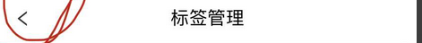

###  记录tm中遇到的组件

##### 1. StorefrontNavBar

 ######  闭合方式

单闭，双闭都可以  

```html
<StorefrontNavBar /> 
<!-- 示例 -->
<StorefrontNavBar title="标签管理"/>
<!-- 如果需要没有返回按钮 -->
<StorefrontNavBar :title="title">
        <attr #hasBack>false</attr>
    </StorefrontNavBar>
```

######  properties

> 1. title  会显示出title属性值


######  标签效果



 ######  组件源码

```typescript
import { MarkupView } from '@triones/biz-kernel';
import { theHistory as history } from '@app/Browser/Ui/theHistory';

export class StorefrontNavBar extends MarkupView {
    public readonly title?: string = '';

    public readonly hasBack?: boolean = true;

    public onClick() {
        history.goBack();
    }
}

```

```html
<template #default>
  <Nav>
    <NavBar mode="light">
        <fragment #icon>
            <dynamic :slot="hasBack">
              <LeftOutlined #true @onClick="onClick" />
            </dynamic>
        </fragment>
        <span className="title">{{title}}</span>
    </NavBar>
  </Nav>
</template>
<style>
  div.Nav {
      position: fixed;
      left: 0;
      right: 0;
      top: 0;
      z-index: 99;

      .am-navbar {
        height: 50px;
        background: #fff;
        box-shadow: 0 6px 13px 0 rgba(235, 235, 235, 0.5);

        .am-navbar-left {
          font-family: PingFangSC;
          font-size: 17px;
          font-weight: 500;
          color: #333333;
        }
      }
  }
</style>
```


#####  2. BasicPageTitle

######  闭合方式

单闭合标签

```html
<BasicPageTitle title="改价" />
```

######  标签效果

#####  3. dynamic

######  闭合方式

双闭合标签

```html
<dynamic :visible="showTitle">
        <StorefrontNavBar title="商家地址管理" />
</dynamic>
```

######  properties

> 1. :visible="boolean value"     如果属性值为true，则显示标签内部的组件
> 2. :slot="some value"    相当于 swith   其内部组件可以有一个 #some value  当与dynamic中的属性值相等时，展示对应的组件


