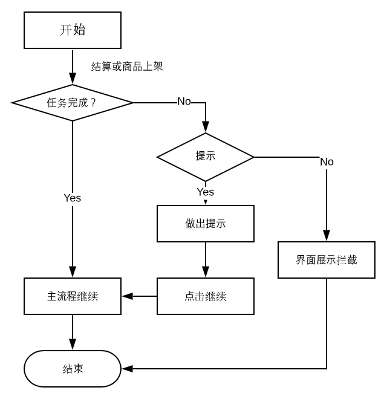

##  开店任务

###  需求

####  功能

1. 负责引导用户进行一些店铺的初始设置

2. 未做任务需要拦截一些功能，目前初始设计为三个功能

   1. 上架商品
      - 任务名称：上架商品
      - 任务描述：需要B端上架商品用户才能看到（需要确认：才能看到什么）
      - 行动引导：去上架，点击去上架进入【商品列表】页面
   2. 店铺装修
      - 任务名称：店铺装修
      - 任务描述：引导商户去装修店铺
      - 行动引导：去装修，点击进入【首页设置】页面
   3. 商户认证
      - 任务名称：商户认证
      - 任务描述：认证后用户才可以下单支付
      - 行动引导：去认证，点击进入【商户认证】界面

   即：该模块需要在界面上实现引导功能，在对应的任务未完成时，拦截对应的流程

#### 流程概要

开店任务提供是否完成开店任务的接口，对将受到影响的流程进行patch，对原有逻辑添加判断，实现控制流程的目的

#### 功能点

#####  1. 主界面展示开店任务

B端主界面展示开店任务卡片，查询开店任务表，获取店铺的未完成的开店任务，以列表形式展示到主界面

##### 2. 查询任务是否完成

需要根据任务完成情况来对逻辑进行拦截，需要完成查询开店任务是否完成功能

##### 3. 限制C端结算

当商户未完成主体认证时，限制C端的支付，表现形式为商品详情的立即购买，选择规模的立即购买按钮不可用，文案修改为暂未开售，购物车的去结算按钮置灰

##### 4. 商品上架提醒

当商户未完成主体认证时，在上架预览界面点击`保存并上架`时，弹框提示未完成主题认证，引导商户主体认证

### 表设计

TaskOfOpenStore

| 字段名   | 字段类型 | 描述                         |
| -------- | -------- | ---------------------------- |
| id       | string   | 主键，任务标识               |
| name     | string   | 任务名称，如”商户认证“等     |
| guidance | string   | 行动引导，如“去装修”等       |
|          | number   | 0-1,0代表已完成，1代表未完成 |

### 接口设计

#####  1. TaskOfOpenStore建表

实体类，用于建立TaskOfOpenStore表

##### 2. 查询接口

提供根据任务名称查询任务完成情况

**参数：**

| 参数名 | 字段类型 | 描述         |
| ------ | -------- | ------------ |
| name   | string   | 开店任务名称 |

**返回值：**

| 类型   | 描述                           |
| ------ | ------------------------------ |
| number | 任务完成状态，0已完成，1未完成 |

##### 3. 支付拦截

未完成主体认证时不可以进行支付，patch对应界面，添加逻辑校验以及界面对应的修改

##### 4. 商品上架提醒
未完成主体认证时，在上架预览界面点击保存并上架按钮时，对商户做出引导
### 流程图
#### 业务流程图

