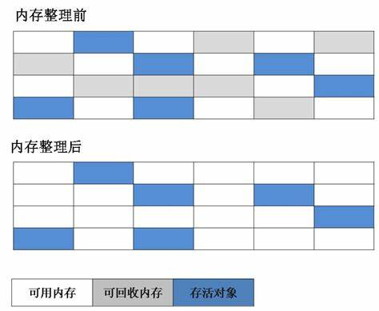
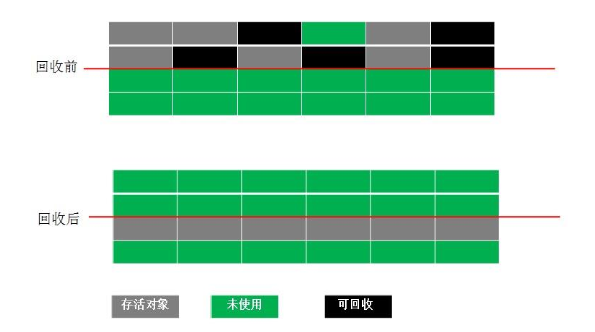
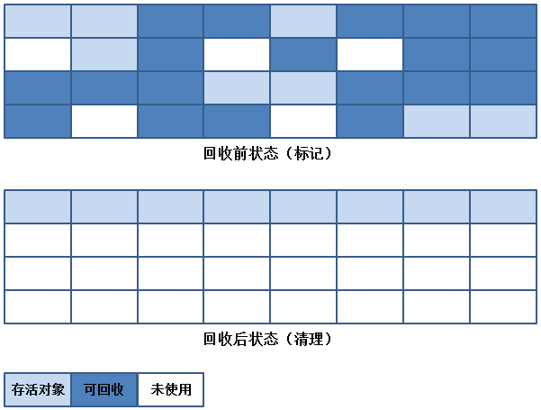
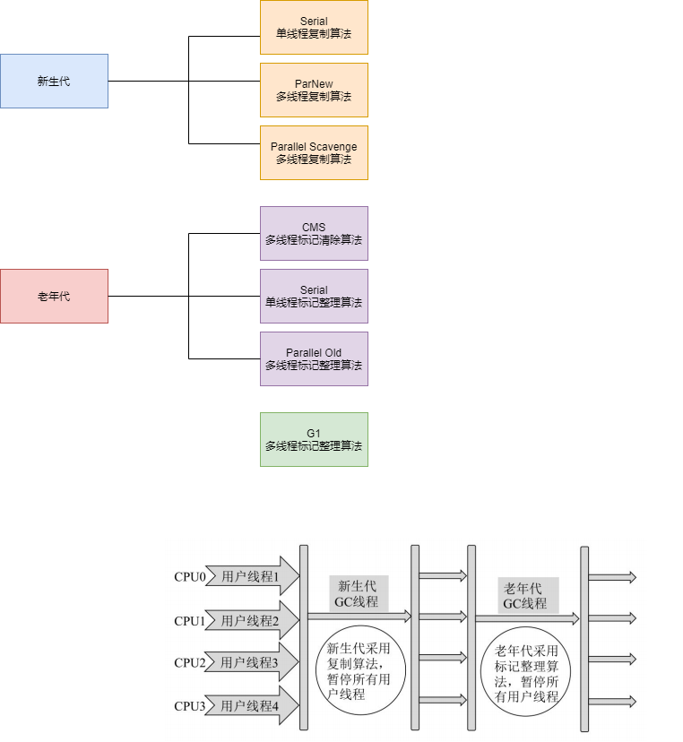
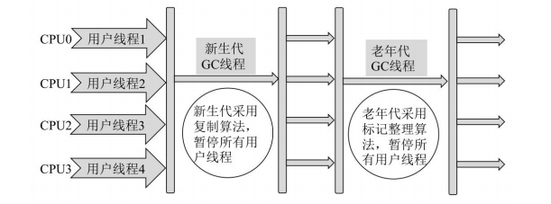
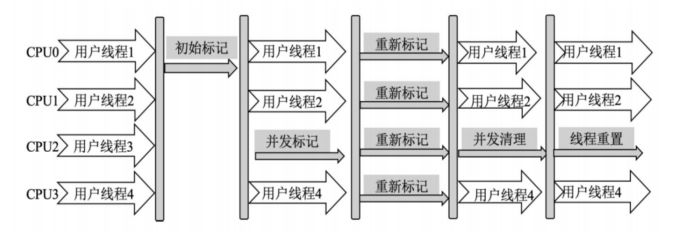

# Java基础

### JVM内存模型

JVM内存分为五大部分：栈，堆，方法区，本地方法栈和程序计数器。

##### 程序计数器

程序计数器是线程私有的，用来记录当前线程的程序执行的行号。在多线程切换时，我们返回当前线程时需要知道程序运行到了哪一步。

##### 本地方法栈

##### 栈

线程私有，每进入一个方法压入一个栈帧，栈帧内存储方法的局部变量表，方法出口，操作数栈等

##### 堆

堆是线程公有的，存储对象，对象内的成员变量等存放的地方

##### 方法区

方法区内存储静态变量，静态方法以及常量等。

### GC

##### 哪些对象需要回收

堆和方法区是线程公有的数据，而堆中主要存放几乎所有的对象实例，所以垃圾回收主要回收堆中的数据。

##### 堆内划分

堆中划分为新生代和老年代

##### 判断对象是否存活

垃圾回收是回收死亡的对象，那么就需要判断对象是否存活。

```
1.引用计数算法
早期判断对象是否存活大多都是以这种算法，这种算法判断很简单，简单来说就是给对象添加一个引用计数器，每当对象被引用一次就加1，引用失效时就减1。当为0的时候就判断对象不会再被引用。
优点:实现简单效率高，被广泛使用与如python何游戏脚本语言上。
缺点:难以解决循环引用的问题，就是假如两个对象互相引用已经不会再被其它其它引用，导致一直不会为0就无法进行回收。

2.可达性分析算法
目前主流的商用语言[如java、c#]采用的是可达性分析算法判断对象是否存活。这个算法有效解决了循环利用的弊端。
它的基本思路是通过一个称为“GC Roots”的对象为起始点，搜索所经过的路径称为引用链，当一个对象到GC Roots没有任何引用跟它连接则证明对象是不可用的。
```

##### java中常用的垃圾回收算法

###### 1. 标记清除算法

标记清除算法是基础的垃圾回收算法，其包含两个阶段：

1. 标记可达对象
2. 将被标记的对象清除



缺点是容易造成内存碎片，容易引发大对象无法获得连续内存的问题。

###### 2. 复制算法

复制算法是为了解决标记清除算法使得内存碎片化而设计的。它将内存空间分为两块儿等大的空间，在垃圾回收时，将存活对象复制到领一块儿区域，然后将当前区域清空。



复制算法效率高且容易实现，缺点是

1. 可用空间只有一半，造成大量的内存浪费
2. 如果当前存活对象较多，复制存活对象就会耗时比较久

###### 3. 标记整理算法

标记整理算法结合了标记清除算法和复制算法的优点，其标记阶段和标记清除算法相同，在标记完成后将存活的对象移动到内存的另一端，然后清除该端的对象并释放内存：



######  4. 分代收集算法

无论哪种算法都无法兼顾所有类型（长生命周期、短生命周期，大对象、小对象）的对象进行垃圾回收。因此，针对不同的类型，JVM采用了不同的垃圾回收算法，该算法称为分代收集算法。

分代收集算法将JVM分为不同的内存区域。将堆划分为新生代和老年代。新生代主要存放刚生成的对象，其特点是数量多但是生命周期短，在每次进行垃圾回收时都有大量的对象被回收；老年代主要存放生命周期长的对象。

目前，大部分JVM对新生代采用复制算法，将新生代分为Eden区和两个Servivor区，Servivor区又分为ServivorFrom区和ServivorTo区。JVM在运行过程中 主要使用Eden区和ServivorFrom区，进行垃圾回收时会将在Eden区和 ServivorFrom区中存活的对象复制到ServivorTo区，然后清理Eden区和 ServivorFrom区的内存空间。

老年代主要存放生命周期较长的对象和大对象，因而每次只有少量非存活的对象被回收，所以在老年代采用标记清除算法。

JVM内存中的对象主要被分配到新生代的Eden区和ServivorFrom区，在 少数情况下会被直接分配到老年代。在新生代的Eden区和ServivorFrom区 的内存空间不足时会触发一次GC，该过程被称为MinorGC。在MinorGC后， 在Eden区和ServivorFrom区中存活的对象会被复制到ServivorTo区，然后 Eden区和ServivorFrom区被清理。如果此时在ServivorTo区无法找到连续 的内存空间存储某个对象，则将这个对象直接存储到老年代。若Servivor 区的对象经过一次GC后仍然存活，则其年龄加 1。在默认情况下，对象在 年龄达到15时，将被移到老年代。

###  四种引用类型

在Java中一切皆对象，对象的操作是通过该对象的引用（Reference） 实现的，Java中的引用类型有4种，分别为强引用、软引用、弱引用和虚引用。

（1）强引用：在Java中最常见的就是强引用。在把一个对象赋给一个 引用变量时，这个引用变量就是一个强引用。有强引用的对象一定为可达 性状态，所以不会被垃圾回收机制回收。因此，强引用是造成Java内存泄 漏（Memory Link）的主要原因。

（2）软引用：软引用通过SoftReference类实现。如果一个对象只有 软引用，则在系统内存空间不足时该对象将被回收。

（3）弱引用：弱引用通过WeakReference类实现，如果一个对象只有 弱引用，则在垃圾回收过程中一定会被回收。 

（4）虚引用：虚引用通过PhantomReference类实现，虚引用和引用队 列联合使用，主要用于跟踪对象的垃圾回收状态。

###  垃圾收集器

Java堆内存分为新生代和老年代：新生代主要存储短生命周期的对 象，适合使用复制算法进行垃圾回收；老年代主要存储长生命周期的对 象，适合使用标记整理算法进行垃圾回收。因此，JVM针对新生代和老年代 分别提供了多种不同的垃圾收集器，针对新生代提供的垃圾收集器有 Serial、ParNew、Parallel Scavenge，针对老年代提供的垃圾收集器有 Serial Old、Parallel Old、CMS，还有针对不同区域的G1分区收集算法，如图：



######  1. Serial 垃圾收集器：单线程，复制算法

 Serial 垃圾收集器基于复制算法实现，它是一个单线程收集器。在它工作时，必须暂停其他所有线程，直到垃圾收集完成

Serial 垃圾收集器采用了复制算法，简单、高效，对于单CPU运行环境来说，没有线程切换开销，可以获得最高的单线程垃圾收集效率，因此 Serial垃圾收集器是Java虚拟机运行在Client模式下的新生代的默认垃圾 收集器。

######  2. ParNew 垃圾收集器：多线程，复制算法

ParNew 垃圾收集器会开和CPU数相同的线程来进行垃圾收集，是Java虚 拟机运行在Server模式下的新生代的默认垃圾收集器。可以通过`-XX:ParallelGCThreads`参数调节线程数。

######  3. Parallel Scavenge垃圾收集器：多线程，复制算法

Parallel Scavenge收集器是为提高新生代垃圾收集效率而设计的垃圾 收集器，基于多线程复制算法实现，在系统吞吐量上有很大的优化，可以 更高效地利用CPU尽快完成垃圾回收任务。 

Parallel Scavenge通过自适应调节策略提高系统吞吐量，提供了三个 参数用于调节、控制垃圾回收的停顿时间及吞吐量，分别是控制最大垃圾 收 集 停 顿 时 间 的 -XX:MaxGCPauseMillis 参 数 ， 控 制 吞 吐 量 大 小 的 - XX:GCTimeRatio 参 数 和 控 制 自 适 应 调 节 策 略 开 启 与 否 的 UseAdaptiveSizePolicy参数。

######  4.  Serial Old 垃圾收集器：单线程，标记整理算法

单线程的标记整理算法，会暂停用户线程，如下图：



######  5. Parallel Old垃圾收集器：多线程，标记整理算法

Parallel Old垃圾收集器采用多线程并发进行垃圾回收，它根据老年 代长生命周期的特点，基于多线程的标记整理算法实现。Parallel Old垃 圾收集器在设计上优先考虑系统吞吐量，其次考虑停顿时间等因素，如果 系统对吞吐量的要求较高，则可以优先考虑新生代的Parallel Scavenge垃 圾收集器和老年代的Parallel Old垃圾收集器的配合使用。

######  6. CMS垃圾收集器

CMS（Concurrent Mark Sweep）垃圾收集器是为老年代设计的垃圾收 集器，其主要目的是达到最短的垃圾回收停顿时间，基于线程的标记清除 算法实现，以便在多线程并发环境下以最短的垃圾收集停顿时间提高系统 的稳定性。

CMS的工作机制相对复杂，垃圾回收过程包含如下4个步骤：

 (1)  初始标记：只标记GC root直达的对象，用户线程不暂停

 (2)  并发标记：和用户线程并发执行，标记所有可达对象

 (3)  重新标记：在并发标记期间可能产生垃圾对象，所以重新标记暂停用户线程并且重新标记可达对象。

 (4)  并发清理：与用户线程一起工作，清除GC Roots不可达对象。

