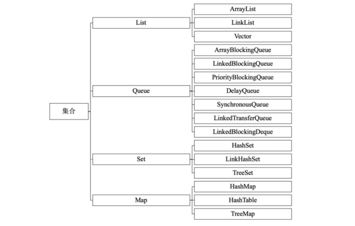
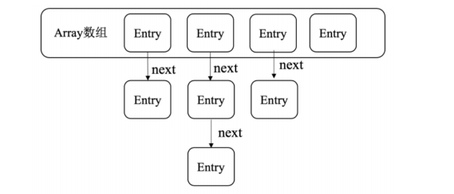

主要包括Java的集合、异常分类及处理、反射机制、注解、内部类、泛型、序列化这几部分内容。

###  集合

Java集合被定义在`java.util`包下，主要包含List、Queue、Set和Map四大类。

####  1. List

#####  1.1 ArrayList：基于数组，线程不安全

基于数组实现，增删慢，改查快。内存中需要一段连续的存储单元。扩容时声明一个更大的数组将现有元素复制到新数组中。

#####  1.2 Vector：基于数组，线程安全

与ArrayList类似，不过它的读写操作会加锁，效率低。

#####  1.3 LinkedList：基于双向链表，线程不安全

增删快，改查慢。基于双向链表实现，可以用来做队列等。

####  2. Queue  队列

Queue是队列结构，Java中常用的队列如下：

- ArrayBlockingQueue：基于数组数据结构实现的有界阻塞队列。 

- LinkedBlockingQueue：基于链表数据结构实现的有界阻塞队列。
- PriorityBlockingQueue：支持优先级排序的无界阻塞队列。 
- PriorityQueue：无界优先级队列  可以用来模仿大顶堆小顶堆，使用`offer()`和`poll()`方法
- DelayQueue：支持延迟操作的无界阻塞队列。 
- SynchronousQueue：用于线程同步的阻塞队列。 
- LinkedTransferQueue：基于链表数据结构实现的无界阻塞队列。 
- LinkedBlockingDeque：基于链表数据结构实现的双向阻塞队列。

####  3. Set  不可重复

Set核心是独一无二的性质。适用于存储无序且不重复的数据，对象相等的本质是对象的HashCode是否相同。

#####  3.1 HashSet   HashTable实现，无序

HashSet根据对象的散列值确定对象的存储位置。如果两个对象的散列值相同，那么判断两个对象是否equals，如果equals判断相等，则认为是同一元素。

#####  3.2 TreeSet  二叉树实现 有序

通过类似二叉排序树一样的结构来存储数据，数据是有序的，但是如果要存储自定义的对象，则需要自定义的类实现`Comparator`接口的`compare`方法或者实现`Comparable`接口的`compareTo`方法

####  4. Map 映射

Map存的是映射关系，即键值对，主要包含以下几个实现类：

#####  4.1 HashMap

基于HashCode的键值对集合，底层采用数组加链表的方式（1.8以后采用数组+链表+红黑树）的方式实现。

其允许多个值为null，只允许有一个null键。

 在多线程情况下可能造成的问题：

1. 进入死循环，大量消耗CPU性能

   进入死循环发生在多线程执行put造成HashMap扩容，造成链表循环引用,

   

2. put的值被覆盖

3. put的值为null

