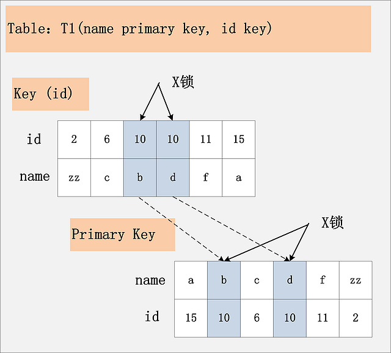
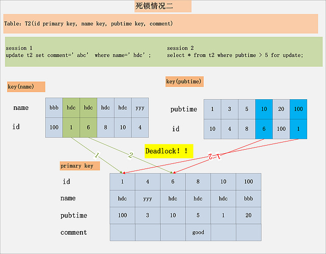

# MySQL

#### 数据库范式

1. 第一范式 1NF

   > 属性不可分割，比如id，name字段，就是不可分割的，而如果是姓名和性别，那么就不满足第一范式

2. 第二范式 2NF

   > 第二范式要求表中要有主键，其他的字段都依赖于主键。主键要可以区分一条记录
   >

3. 第三范式 3NF

   > 第三范式要求一个表中不能含有另一个表中非主键的字段，即我们如果需要存储其他表中的数据，就需要以外键形式关联另一张表的主键。属性不依赖其他非主属性

### 索引

#### 数据库中最常见的慢查询优化方式是什么？

为查询的列添加索引

#### 为什么加索引能优化查询速度

因为索引是一种优化查询的数据结构，比如MySQL的索引是使用B+树实现的，B+树可以加快查询速度。

#### 有哪些数据结构可以优化查询速度

1. hash表

   > Hash表根据字段算出hash值后存储在hash表中，可以达到O(1)的查询复杂度，但是无法查询范围查询

2. 完全平衡二叉搜索树

   > 二叉搜索树，左子节点小于当前节点，右子节点大于当前节点，在查询时就可以很方便的选择进入左子节点后者右子节点，并且可以根据中序遍历查询范围。

3. B树

   > B是一种多路搜索树，它的节点可以有多个子节点，且每个节点可以存储多个值，所以它比二叉搜索树更矮胖，可以减少磁盘IO次数

4. B+树

   > B+树是B树的变种，B+树的非叶子节点不存储数据，非叶子节点上存储的是子节点的最大值或最小值，叶子节点形成了一条链表。

#### 为什么MySql采用B+树作为索引

1. 减少了磁盘IO次数

   > 如果是二叉搜索树，那么比起B树过于高且瘦，将节点从硬盘中读入内存中的次数更多

2. 支持范围查询

   > 如果采用hash表结构，那么无法支持范围查询操作

##### 为什么不用B树

1. B树的非叶子节点也存储数据，当需要进行范围查找时，需要进行中序遍历，而B+树的叶子节点之间形成了链表，得到边界后可以以遍历链表得到结果集
2. B+树的非叶子节点不存储数据，也就是它的非叶子节点相比B树可以存储更多个节点信息，比起B树更为矮胖，更减少了磁盘IO次数

####  二级索引

在MyISAM存储引擎冲使用的是非聚簇索引，所以主键索引与二级索引存储的都是数据的地址值

在Innodb引擎中使用的是聚簇索引，即主键索引的叶子节点上存储的就是数据，二级索引中存储的是主键值。

#### 最左匹配原则

最左匹配适用于组合索引，如下为组合索引的图解


我们可以看到。最左边的列是有序的，后面的列是无序的。但是当左边的值确定时，右侧的列也是有序的。

1. 全值查询

   ```sql
   select * from table_name where a = '1' and b = '2' and c = '3' 
   select * from table_name where b = '2' and a = '1' and c = '3' 
   select * from table_name where c = '3' and b = '2' and a = '1' 
   ```

   会用到组合索引

2. 匹配左边的列时

   ```sq
   select * from table_name where a = '1' 
   select * from table_name where a = '1' and b = '2'  
   select * from table_name where a = '1' and b = '2' and c = '3'
   ```

   带上了a列，所以用到了组合索引

   如果没有查询a列，则不会使用组合索引。

   ```sql
   select * from table_name where  b = '2' 
   select * from table_name where  c = '3'
   select * from table_name where  b = '1' and c = '3' 
   ```

3. 范围查找时

   ```sql
   select * from table_name where  a > 1 and a < 3
   ```

   可以对最左的列使用范围匹配，使用索引

   ```sql
   select * from table_name where  a > 1 and a < 3 and b > 1;
   ```

   先在索引中检索出 `a > 1` 与 `a < 3`，之后在结果集中检索`b > 1`，使用explain语句测试为index。 
   
4. 匹配列前缀
   
   ```sql
       select * from table_name where a like 'As%'; //前缀都是排好序的，走索引查询
       select * from table_name where  a like '%As'//全表查询
       select * from table_name where  a like '%As%'//全表查询
   ```
   
5. 精确匹配某一列并范围匹配另一列

   ```sql
   select * from table_name where  a = 1 and b > 3;
   ```

   会走索引

### MySQL事务隔离级别和MVCC

#### 隔离级别

##### 读未提交

一个事务可以督导另一个事务未提交的内容。

##### 读已提交

一个事务只能读到另一个已经提交的事务修改的数据，并且其他食物没对该数据进行一次修改并提交后，该事务都能查询到最新值，称为读已提交

##### 可重复读

在一个事务中select一行数据一次或者更多次，产生的结果集总是相同的，我们称之为可重复读。

##### 串行化

不允许多个事务进行读-写操作，会加锁进行阻塞。

#### MCVV

MySQL采用版本链来进行版本控制，对于使用InnoDB存储引擎的表来说，它的聚簇索引记录中都包含两个必要的隐藏列：

- trx_id：每次对某条聚簇索引记录进行改动时，都会把对应的事务id赋值给trx_id隐藏列
- roll_pointer：每次对某条聚簇索引记录进行改动时，都会把旧的版本写入到undo日志中，然后这个隐藏列就相当于一个指针，可以通过它来找到该记录修改前的信息。

在插入信息时，不含roll_pointer，因为没有更早的版本了，更新后会形成一条版本链，版本链如下图所示：


#### ReadView

对于读未提交的事务来说，每次查询的时候直接读取记录的最新版本就好了，对于使用串行化的事务，使用加锁的方式来访问记录，对于使用读已提交和可重复读隔离级别的事务来说，需要用到版本链了。

核心问题是：版本链中的哪个版本是当前事务可见的。所以引入了ReadView的概念。它是一个列表，包含当前系统中还有哪些活跃的读写事务，命名为m_ids，在访问某条记录时，只需要按照下面的步骤判断记录的某个版本是否可见：

1. 如果被访问版本的trx_id小于m_ids的事务的最小id，那么说明该版本的事务在生成ReadView前已经提交，所以该版本的事务可以被当前事务访问。
2. 如果被访问的版本的trx_id大于m_ids内的事务的最大id，那么说明该版本的事务在生成ReadView后才生成，所以该版本的事务不可以被当前事务访问
3. 如果放荡问的trx_id在ReadView列表的最大id和最小id之间，需要判断trx_id是否在m_ids中，如果在，说明在创建ReadView时生成该版本的事务还是活跃的，该版本不可被访问，如果不在，说明在生成ReadView时该版本的事务已经被提交，该版本可以被访问。

如果某个版本中的数据对当前事务不可见的话，就顺着版本链找到下一个版本的数据，继续按照上面的步骤判断可见性，以此类推，如果知道版本链中的最后一个版本都不包含该记录，那么意味着该条记录对该事务不可见，查询结果不包含该记录。

在MySQL中读已提交和可重复读主要时生成ReadView的时机不同。

##### 读已提交

**每次读取一个数据前都生成一个ReadView**

假设现在有两个事务：100和200在执行。

```sql
# Transaction 100
BEGIN;
 
UPDATE t SET c = '关羽' WHERE id = 1;
 
UPDATE t SET c = '张飞' WHERE id = 1;
```

```sql
# Transaction 200
BEGIN;
 
# 更新了一些别的表的记录
...
```

此时，id为1的记录的版本链如下：


这时我们新开一个事务来查询：

```sql
# 使用READ COMMITTED隔离级别的事务
BEGIN;
 
# SELECT1：Transaction 100、200未提交
SELECT * FROM t WHERE id = 1; # 得到的列c的值为'刘备'
```

这时的流程为：

1. 生成ReadView，得到[100, 200]
2. 得到_张飞'_这个版本，发现trx_id在ReadView列表中，所以不可见，继续向下
3. 得到_'关羽'_这个版本，发现trx_id在ReadView列表中，该版本也不可见，进入下一个版本
4. 得到_'刘备'_版本，发现该版本可见，则返回_'刘备'_这个记录

此时新开的事务依旧没有提交，将100事务提交并且200事务做出修改：

```sql
# Transaction 100
BEGIN;
 
UPDATE t SET c = '关羽' WHERE id = 1;
 
UPDATE t SET c = '张飞' WHERE id = 1;
 
COMMIT;
```

```sql
# Transaction 200
BEGIN;
 
# 更新了一些别的表的记录
...
 
UPDATE t SET c = '赵云' WHERE id = 1;
 
UPDATE t SET c = '诸葛亮' WHERE id = 1;
```

此时的版本链如下：


当前事务进行查询：

```sql
# 使用READ COMMITTED隔离级别的事务
BEGIN;
 
# SELECT1：Transaction 100、200均未提交
SELECT * FROM t WHERE id = 1; # 得到的列c的值为'刘备'
 
# SELECT2：Transaction 100提交，Transaction 200未提交
SELECT * FROM t WHERE id = 1; # 得到的列c的值为'张飞'
```

执行SELECT2时生成的ReadView列表为：[200]，所以_'诸葛亮'_到_'赵云'_对大哥前十五来说不可见，最终会返回_'张飞'_

**读已提交在每次查询时生成一个ReadView**

**可重复读——在第一次读取数据时生成一个ReadView**

还是100， 200 两个事务在执行：

```sql
# Transaction 100
BEGIN;
 
UPDATE t SET c = '关羽' WHERE id = 1;
 
UPDATE t SET c = '张飞' WHERE id = 1;
```

```sql
# Transaction 200
BEGIN;
 
# 更新了一些别的表的记录
...
```

版本链为：


此时有一个可重复读的事务开始执行读取：

```sql
# 使用REPEATABLE READ隔离级别的事务
BEGIN;
 
# SELECT1：Transaction 100、200未提交
SELECT * FROM t WHERE id = 1; # 得到的列c的值为'刘备'
```

此时执行流程如下：

1. 生成ReadView，得到[100, 200]
2. 得到_张飞'_这个版本，发现trx_id在ReadView列表中，所以不可见，继续向下
3. 得到_'关羽'_这个版本，发现trx_id在ReadView列表中，该版本也不可见，进入下一个版本
4. 得到_'刘备'_版本，发现该版本可见，则返回_'刘备'_这个记录

依然提交100，200修改未提交：

```sql
# Transaction 100
BEGIN;
 
UPDATE t SET c = '关羽' WHERE id = 1;
 
UPDATE t SET c = '张飞' WHERE id = 1;
 
COMMIT;
```

```sql
# Transaction 200
BEGIN;
 
# 更新了一些别的表的记录
...
 
UPDATE t SET c = '赵云' WHERE id = 1;
 
UPDATE t SET c = '诸葛亮' WHERE id = 1;
```

此时，版本链为：


这时这个可重复读的事务继续查询：

```sql
# 使用REPEATABLE READ隔离级别的事务
BEGIN;
 
# SELECT1：Transaction 100、200均未提交
SELECT * FROM t WHERE id = 1; # 得到的列c的值为'刘备'
 
# SELECT2：Transaction 100提交，Transaction 200未提交
SELECT * FROM t WHERE id = 1; # 得到的列c的值仍为'刘备'
```

执行过程如下：

1. 之前已经生成过ReadView，所以此时直接复用之前的ReadView，列表就为[100, 200]
2. 然后就继续从版本链中找到trx_id不在列表中的版本，并返回
3. 返回_'刘备'_这个版本

> 从上述中我们可以得到，MySQL的MVCC机制是引用了版本链以及ReadView。读未提交时直接读取最新的版本，串行化需要加锁执行，当前事务执行其他事务阻塞。在读已提交和可重复读时根据ReadView列表访问版本链来确定版本。

#### 何时当前读，何时快照读

**快照读：**简单的select语句采用快照读

```sql
 select * from table where ?;
```

**当前读：**特殊的读操作，插入/更新/删除操作，属于当前读，需要加锁。

```sql
select * from table where ? lock in share mode;

select * from table where ? for update;

insert into table values (…);

update table set ? where ?;

delete from table where ?;
```


### MySQL锁机制

MySQL的RR级别的事务可以防止幻读，实现的方法是加间隙锁。

#### 加锁过程分析

```sql
delete from t1 where id = 10;
```

- **组合一：**id列是主键，RC隔离级别
- **组合二：**id列是二级唯一索引，RC隔离级别
- **组合三：**id列是二级非唯一索引，RC隔离级别
- **组合四：**id列上没有索引，RC隔离级别
- **组合五：**id列是主键，RR隔离级别
- **组合六：**id列是二级唯一索引，RR隔离级别
- **组合七：**id列是二级非唯一索引，RR隔离级别
- **组合八：**id列上没有索引，RR隔离级别
- **组合九：**Serializable隔离级别

##### 组合一：

将主键上`id = 10`的记录加X锁：


##### 组合二：

如果id是二级唯一索引，那么会先将二级索引的`id = 10`的记录加X锁，然后在主键的聚簇索引加X锁。


> 结论：如果id是唯一索引，那么首先会在唯一索引中找到该记录加X锁，之后给主键的聚簇索引加X锁。

##### 组合三：

如果id是非唯一二级索引，则将索引上满足`id = 10`的列都加锁，然后对应的主键索引上也会加锁



> 结论：二级索引都是会将二级索引加锁之后再将主键索引加锁

##### 组合四：

由于id列上没有索引，那么只能锁住全部的数据，由innoDB返回给MySQL的server，MySQL的server经过判断后，再将不满足条件的记录释放锁，但所有的记录都要加一遍锁。


> 结论：若id列上没有索引，sql会走聚簇索引的全表扫描进行过滤，因为过滤是MySQL Server层面进行的，所以会将所有的记录都加上X锁，对于不满足条件的数据，会判断之后释放锁

##### 组合五：

与组合一的加锁一样，直接在主键索引上加X锁

##### 组合六：

组合六的加锁顺序与组合一一样，先加唯一索引的X锁，再加聚簇索引的X锁

##### 组合七：

RR级别的事务是可以防止幻读的，非唯一二级索引在`id = 10`情况下可能查出多条，那么MySQL如何防止幻读呢？


就是GAP锁，也就是间隙锁。如果要保证两次独到的数据是一样的，那么就需要在事务执行期间，不允许在结果集中操作数据。

如图中所示，有哪些位置可以插入新的满足条件的项 (id = 10)，考虑到B+树索引的有序性，满足条件的项一定是连续存放的。记录[6,c]之前，不会插入id=10的记录；[6,c]与[10,b]间可以插入[10,  aa]；[10,b]与[10,d]间，可以插入新的[10,bb],[10,c]等；[10,d]与[11,f]间可以插入满足条件的[10,e],[10,z]等；而[11,f]之后也不会插入满足条件的记录。因此，为了保证[6,c]与[10,b]间，[10,b]与[10,d]间，[10,d]与[11,f]不会插入新的满足条件的记录，MySQL选择了用GAP锁，将这三个GAP给锁起来。

> **结论：Repeatable Read隔离级别下，id列上有一个非唯一索引，对应SQL：delete  from t1 where id = 10;  首先，通过id索引定位到第一条满足查询条件的记录，加记录上的X锁，加GAP上的GAP锁，然后加主键聚簇索引上的记录X锁，然后返回；然后读取下一条，重复进行。直至进行到第一条不满足条件的记录[11,f]，此时，不需要加记录X锁，但是仍旧需要加GAP锁，最后返回结束。**

##### 组合八：

id列上无索引，那么就会查询所有的数据，给所有的数据加X锁以及给所有的GAP加GAP锁


> **结论：在Repeatable  Read隔离级别下，如果进行全表扫描的当前读，那么会锁上表中的所有记录，同时会锁上聚簇索引内的所有GAP，杜绝所有的并发 更新/删除/插入  操作。当然，也可以通过触发semi-consistent read，来缓解加锁开销与并发影响，但是semi-consistent  read本身也会带来其他问题，不建议使用。**

##### 组合九

当Serializable级别下的事务查询时，查询的是当前最新记录，而不是快照读

##### 复杂SQL的例子


拆分where条件：

```sql
pubtime > 1 and pubtime < 20
```

得到 [3, 20)的数据，会在其内GAP添加GAP锁，对应的主键索引添加X锁

#### 死锁分析




> **结论：死锁的发生与否，并不在于事务中有多少条SQL语句，死锁的关键在于：两个(或以上)的Session加锁的顺序不一致。而使用本文上面提到的，分析MySQL每条SQL语句的加锁规则，分析出每条语句的加锁顺序，然后检查多个并发SQL间是否存在以相反的顺序加锁的情况，就可以分析出各种潜在的死锁情况，也可以分析出线上死锁发生的原因。**