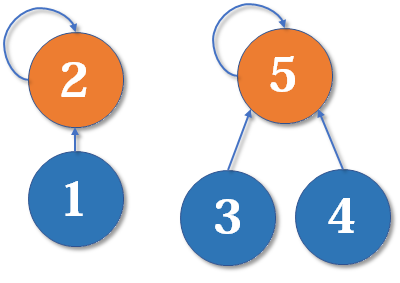

并查集主要用于解决一些**元素分组**问题。它管理一系列**不相交的集合**，并支持两种操作：

- **合并**：把两个不相交的集合合并为一个集合
- **查询**：查询两个元素是否在同一个集合中

**最佳应用**：亲戚问题

> **题目背景**
>
> 若某个家族人员过于庞大，要判断两个人是否是亲戚，确实还很不容易，现在给出某个亲戚关系图，求任意给出的两个人是否具有亲戚关系。
>
> **题目描述**
>
> 规定：x和y是亲戚，y和z是亲戚，那么x和z也是亲戚。如果x,y是亲戚，那么x的亲戚都是y的亲戚，y的亲戚也都是x的亲戚。

可以建模，把所有有亲戚关系的人放到一个集合中，判断两个人是否是亲戚，只需要看是否在同一个集合中。因此，可以考虑用并查集进行维护。

并查集在一开始时每个集合中只有自己，然后对集合进行查找看是否在集合中，再对集合进行合并

**初始化**

```java
public int[] fa;
public void init(int n) {
  fa = new int[n + 1];
  for (int i = 1; i < n + 1; i++) {
    fa[i] = i;
  }
}
```

使用数组fa来存储当前节点的父节点，一开始是n个不相关的集合，所以每个元素的父元素是他自己

**查询**

```java
public int find(int x) {
  if (fa[x] == x) {
    return x;
  }
  return find(fa[x]);
}
```

查询查找的是该元素的父元素，一路往上找，直到找到根节点，如果两个元素的根节点相同，则证明他俩属于同一集合。

**合并**

```java
public void merge(int i, int j) {
  fa[find(i)] = find(j);
}
```

把`i`的父节点的父节点设置为`j`的父节点。合并两个集合，相当于x和y是亲戚，则x和y要合并到一个并查集中。

**路径压缩**

这个查询的效率是很低的，因为如果我们一直合并且查找，会形成一个链式的集合，复杂度会变高：

我们首先merge(2, 1)


然后要merge(2, 3)，从2找到1，`fa[1] = 3`，于是就会形成如下：


此时再来一个元素4，我们要merge(2, 4)，2找到1，1找到3，执行`fa[3] = 4`


逐渐变得复杂，可以使用路径压缩，当前节点的`fa[i]`记录自己的根节点，而不是父节点：

```java
public int find(int x) {
  if (x == fa[x]) {
    return x;
  }
  // 父节点记录根节点
  fa[x] = find(fa[x]);
  // 返回父节点（根节点）
  return fa[x];
}
```

可以简化为一行：

```java
public int find(int x) {
  return x == fa[x] ? x : (fa[x] = find(x);
}
```

**按秩合并**

以上图为例，我们合并2和4时。是将3置为4的父节点还是4置为3的父节点？应该是将4置为3的父节点，这样2和1的父节点还是3，不会影响到其他节点。所以我们选择深度较深的集合来合并浅集合。

**初始化**

```java
public int[] fa;
public int[] rank;
public void init(int n) {
  fa = new int[n + 1];
  rank = new int[n + 1];
  for (int i = 0; i < n + 1; i++) {
    fa[i] = i;
    rank[i] = 1;
  }
}
```

**合并**

```java
public void merge(int i, int j) {
  int x = find(i);
  int j = find(j);
  if (rank[x] <= rank[y]) {
    fa[x] = y;
  } else {
    fa[y] = find(x);
  }
  if (rank[x] == rank[y] && x != y) {
    rank[y]++;
  }
}
```

当深度相同的时候，我们设置y为父节点，为什么`rank[y]++`呢？如下图：



将2的父节点设为5，会变成如下：


即当前元素加上要合并的元素的深度，而此时两者深度相同，则为`rank[y]++`


永辉超市成立于2001年，2010年在A股上市，是中国企业500强之一，是国家级“流通”及“农业产业化”双龙头企业。永辉超市是中国大陆首批将生鲜农产品引进现代超市的流通企业之一，被国家七部委誉为中国“农改超”推广的典范，通过农超对接，以生鲜特色经营及物美价廉的商品受到百姓认可，被誉为“民生超市、百姓永辉”。


中国五百强企业之一的永辉超市，相对而言是比较年轻而又成功的企业。于2001年成立，九年后于A股上市。它是首批在中国大陆将生鲜农产品引进现代超市的流通企业之一，因此它被评价为国家级“流通”以及“农业产业化”的双龙头企业，国家七部委称其为中国“农改超”推广的典型企业。通过生鲜农产品以及现代超市对接，用特色的经营方式——以生鲜为特色经营，且价格亲民而广受百姓认可，被冠以“民生超市”以及“百姓永辉”等美誉。